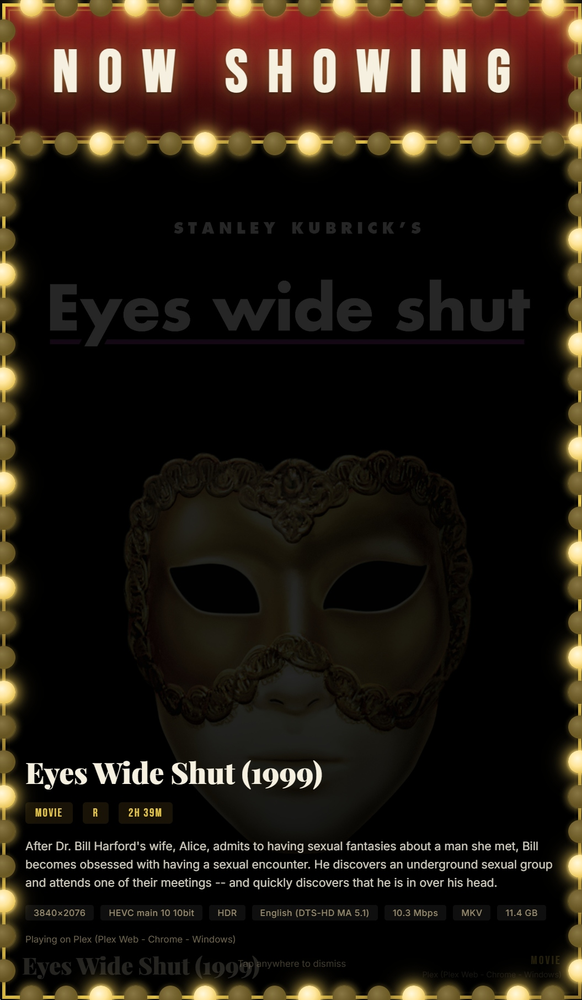
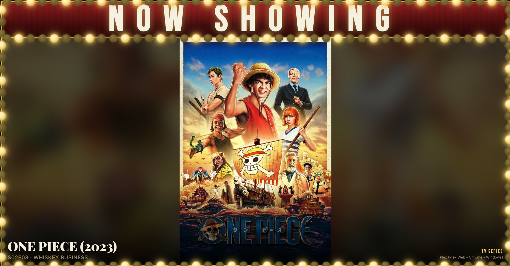

# Kodi Now Showing

A full-screen cinema marquee display for Home Assistant that shows what's currently playing on Kodi. Designed for wall-mounted tablets using Fully Kiosk Browser.

Features animated chase bulb lights, a red curtain banner, poster art with title overlays, and automatic switching between your dashboard and the Now Showing page.


<p align="center">
  
  &nbsp;&nbsp;
  
</p>

<p align="center">
  
</p>

## Features

- Cinema-style marquee with animated chase bulb lights around the border
- Red curtain banner with "NOW SHOWING" text
- Full-bleed poster art from the currently playing media
- Title, episode info (for TV), and playback state overlays
- **Tap for info** — tap the poster to see media type, content rating, duration, and player details
- **Landscape mode** — optional flag to fit the entire poster on widescreen displays
- Filters to a specific Kodi `media_player` entity so only your playback shows up
- Idle state when nothing is playing
- Optional automation to switch a Fully Kiosk Browser tablet between your dashboard and the Now Showing page

---

## What You Need

- **Home Assistant** with the [Kodi integration](https://www.home-assistant.io/integrations/kodi/) configured
- **Kodi** with the web interface enabled (see below)
- **Fully Kiosk Browser** (optional) — for automatic switching between your dashboard and the Now Showing page

---

## Files

| File | Description |
|------|-------------|
| `www/now_showing.html` | The full-screen marquee page |
| `automations/kodi_now_showing_display.yaml` | Automation to auto-switch a tablet when playback starts/stops |

---

## Setup

**Step 1 — Copy the file**

Place `www/now_showing.html` into your Home Assistant `www` directory:

```
<config>/www/now_showing.html
```

You can do this via the **File Editor** add-on, **Samba**, **SSH**, or the **VS Code** add-on.

**Step 2 — Configure your settings**

Open `now_showing.html` and update these values near the top of the `<script>` section:

```javascript
const HA_URL = 'http://YOUR_HA_IP:8123';           // Your Home Assistant URL
const HA_TOKEN = 'YOUR_LONG_LIVED_ACCESS_TOKEN';    // HA long-lived access token
const KODI_ENTITY = 'media_player.kodi';            // Your Kodi media_player entity ID
```

To create a long-lived access token:
1. Go to your HA profile (click your name in the sidebar)
2. Scroll to "Long-Lived Access Tokens"
3. Click "Create Token", give it a name, and copy the token

**Step 3 — Open it**

Navigate to `http://YOUR_HA_IP:8123/local/now_showing.html` in a browser to test it. If Kodi is playing something, you should see the poster appear.

**Step 4 (Optional) — Set up the automation**

If you want a Fully Kiosk Browser tablet to automatically switch to the Now Showing page when playback starts:

1. Copy the contents of `automations/kodi_now_showing_display.yaml` into your `automations.yaml` file, or recreate it through the HA UI
2. Update the following values in the automation:

| What to change | Where in the file | How to find yours |
|---|---|---|
| **Kodi entity** | `entity_id: media_player.kodi` (appears in triggers and conditions) | Go to **Developer Tools → States**, search for your Kodi player. Look for a `media_player.*` entity whose state changes to `playing` when Kodi plays something. |
| **Fully Kiosk device ID** | `device_id: YOUR_FULLY_KIOSK_DEVICE_ID` (appears 2 times) | Go to **Settings → Devices**, find your Fully Kiosk tablet, and copy the device ID from the URL (the long string after `/device/`). |
| **Now Showing URL** | `url:` in the first action | Change to `http://YOUR_HA_IP:8123/local/now_showing.html` |
| **Dashboard URL** | `url:` in the second action | Change to the URL of the dashboard you want to return to after playback stops (e.g., `http://YOUR_HA_IP:8123/lovelace/0`). |

---

## How It Works

- Polls Home Assistant's API every 5 seconds for the Kodi `media_player` entity state
- Displays the current media's poster art as a full-bleed background
- Shows title, episode info (for TV), and playback state
- When nothing is playing, shows an idle "Waiting for playback" state
- The automation triggers when the Kodi `media_player` state changes to `playing`, `idle`, or `off` — it waits 5 seconds then loads the Now Showing page, or waits 10 seconds after playback stops to return to your dashboard

---

## Tap for Info

Tap anywhere on the poster while media is playing to show an info panel. It slides up from the bottom and shows:

- Title and episode info
- Media type (Movie / TV Series), content rating, and duration
- Player name

The panel auto-dismisses after 8 seconds, or tap again to close it.

---

## Customization

| Setting | Where | Default |
|---------|-------|---------|
| Poll interval | `POLL_INTERVAL` in script | 5000ms (5 seconds) |
| Kodi entity | `KODI_ENTITY` in script | `media_player.kodi` |
| Landscape mode | `LANDSCAPE_MODE` in script | `false` (poster fills screen, may crop) |
| Marquee text size | `.marquee-text h1` font-size in CSS | `clamp(3.5rem, 10vw, 8rem)` |
| Bulb size | `.bulb` width/height in CSS | 28px |
| Bulb spacing | `spacing` in `createOuterBulbs()` | 42px |
| Chase animation speed | `setInterval(animateChase, ...)` | 500ms |

### Landscape Mode

If you're using a landscape/widescreen display instead of a portrait tablet, set `LANDSCAPE_MODE = true`. This fits the entire poster on screen with letterboxing (black bars) instead of cropping to fill.

---

## Troubleshooting

- **Blank poster**: Check that your HA token is valid and the Kodi `entity_picture` URLs are accessible from the device
- **Nothing showing while Kodi is playing**: Verify your `KODI_ENTITY` matches the entity ID in Developer Tools → States
- **Automation not triggering**: Confirm your Kodi `media_player` entity state changes correctly when playback starts/stops. Check **Developer Tools → States** to monitor state changes.

---

## Related

- [kodi-recently-added-card](https://github.com/rusty4444/kodi-recently-added-card) — Lovelace card showing recently added Kodi media
- [plex-now-showing](https://github.com/rusty4444/plex-now-showing) / [plex-recently-added-card](https://github.com/rusty4444/plex-recently-added-card) — Plex versions
- [jellyfin-now-showing](https://github.com/rusty4444/jellyfin-now-showing) / [jellyfin-recently-added-card](https://github.com/rusty4444/jellyfin-recently-added-card) — Jellyfin versions

---

## Credits

Built by Sam Russell — AI used in development.
